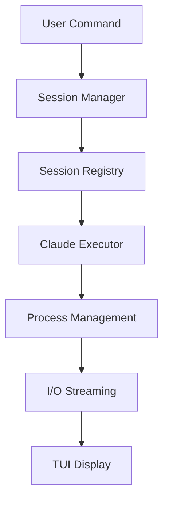
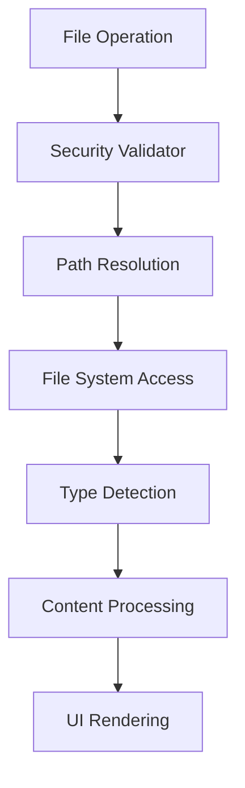
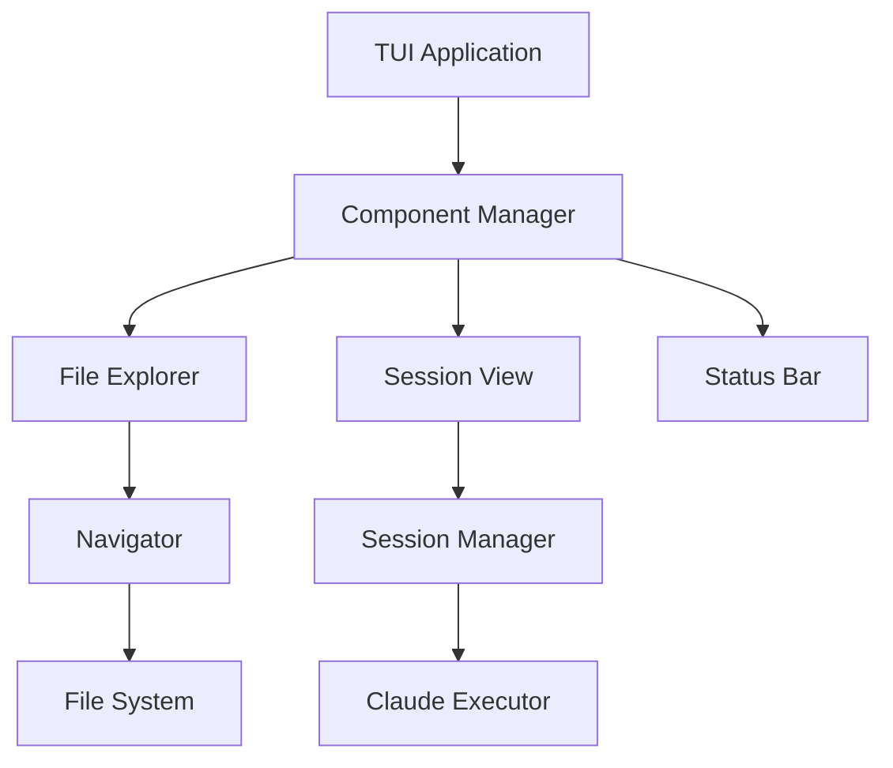

# Architecture Overview

This document describes the enhanced modular architecture of the vibes-mcp-cli, which has been transformed from a simple MCP CLI into a comprehensive Claude Code session manager with advanced file navigation, session management, and secure TUI components.

## Modern Architecture

The system now features a layered, modular architecture designed for scalability, security, and maintainability:

```
vibes-mcp-cli/
├── cmd/                    # Cobra-based CLI commands and enhanced TUI
│   ├── root.go             # Entrypoint and global flags
│   ├── completion.go       # Legacy 'completion' subcommand
│   ├── chat.go             # Legacy 'chat' subcommand
│   ├── embed.go            # Legacy 'embed' subcommand
│   ├── models.go           # Legacy 'models' subcommand
│   ├── server.go           # HTTP server with enhanced APIs
│   └── ui.go               # Modern TUI with Claude Code integration

├── internal/
│   ├── app/                # Core application components
│   │   ├── claude/         # Claude Code execution and process management
│   │   │   ├── executor.go # Process execution and resource monitoring
│   │   │   ├── process.go  # Individual process management
│   │   │   ├── resource_monitor.go # Resource usage tracking
│   │   │   └── session.go  # Claude Code session abstraction
│   │   ├── files/          # Enhanced file navigation system
│   │   │   ├── navigator.go    # Secure file system navigation
│   │   │   ├── search.go       # Advanced file search capabilities
│   │   │   ├── security.go     # Path validation and access control
│   │   │   └── syntax.go       # File type detection and highlighting
│   │   ├── session/        # Session management layer
│   │   │   ├── manager.go      # Multi-session orchestration
│   │   │   └── registry.go     # Session persistence and discovery
│   │   └── testutil/       # Testing utilities and mocks
│   ├── client/             # Type-safe HTTP client for LLM APIs
│   ├── config/             # Enhanced configuration management
│   ├── mcp/                # MCP protocol implementation
│   ├── providers/          # Multi-provider LLM abstraction
│   ├── service/            # Service layer and API coordination
│   └── ui/                 # Modern TUI components
│       └── components/     # Reusable UI components
│           ├── file_explorer.go # Advanced file explorer widget
│           └── session_view.go  # Session management interface

├── docs/                   # Comprehensive documentation
├── dist/                   # Cross-platform binaries
├── Makefile               # Enhanced build and development commands
├── docker-compose.yml     # Container orchestration
├── Dockerfile             # Multi-stage container build
├── LICENSE
└── README.md
```

## Architectural Principles

### 1. Layered Architecture

The system follows a clean layered architecture with clear separation of concerns:

- **Presentation Layer** (`cmd/`, `internal/ui/`): CLI commands and TUI components
- **Application Layer** (`internal/app/`): Core business logic and orchestration
- **Service Layer** (`internal/service/`): API coordination and provider abstraction
- **Infrastructure Layer** (`internal/client/`, `internal/mcp/`): External service integration

### 2. Domain-Driven Design

Core domains are encapsulated in dedicated packages:

- **Session Domain** (`internal/app/session/`): Session lifecycle and state management
- **File Domain** (`internal/app/files/`): File system operations and security
- **Claude Domain** (`internal/app/claude/`): Process execution and I/O management

### 3. Security-First Design

Security is integrated at every layer:

- **Path Validation**: Comprehensive path traversal protection
- **Resource Limits**: Process and memory usage constraints
- **Access Control**: Allowlist/denylist path management
- **Input Sanitization**: All user inputs are validated and sanitized

## Core Components

### Session Management Layer

The session management system provides comprehensive Claude Code session orchestration:

```go
// High-level session management
type Manager struct {
    config    *ManagerConfig
    executor  *claude.Executor
    registry  *Registry
    sessions  map[string]*claude.Session
}
```

**Key Features:**
- Multi-session support with resource isolation
- Session persistence and recovery across restarts
- Real-time I/O streaming and capture
- Automatic cleanup and resource management
- Comprehensive session statistics and monitoring

### File Navigation System

Enhanced file navigation with enterprise-grade security:

```go
// Secure file system navigation
type Navigator struct {
    validator   *SecurityValidator
    detector    *SyntaxDetector
    searcher    *FileSearcher
    history     *NavigationHistory
}
```

**Security Features:**
- Path traversal attack prevention
- Symlink target validation
- Resource exhaustion protection
- File size and depth limits
- Hidden file access control

**Navigation Features:**
- Tree-based directory traversal
- Advanced search with regex support
- File type detection and syntax highlighting
- Navigation history and breadcrumbs
- Lazy loading for performance

### Claude Code Integration

Comprehensive Claude Code process management and integration:

```go
// Process execution and management
type Executor struct {
    resourceMonitor *ResourceMonitor
    processes       map[int]*Process
    limits          *ResourceLimits
}
```

**Process Management:**
- Secure process execution with resource limits
- Real-time I/O capture and streaming
- Process lifecycle management
- Resource usage monitoring
- Error handling and recovery

### UI Component System

Modern, reusable TUI components built on tview:

```go
// File explorer component
type FileExplorer struct {
    *tview.Flex
    navigator    *files.Navigator
    treeView     *tview.TreeView
    previewView  *tview.TextView
}
```

**Component Features:**
- Keyboard-driven navigation (vim-style)
- Real-time file preview
- Search integration
- Context-sensitive actions
- Theme and customization support

## Data Flow Architecture

### 1. Session Workflow



1. **User Input**: Commands via CLI or TUI
2. **Session Orchestration**: Manager handles session lifecycle
3. **Process Execution**: Executor manages Claude Code processes
4. **I/O Management**: Real-time input/output streaming
5. **UI Updates**: Live feedback and status updates

### 2. File Navigation Workflow



1. **Security Validation**: All paths validated against security policies
2. **File System Operations**: Secure file system access
3. **Type Detection**: Intelligent file type identification
4. **Content Processing**: Syntax highlighting and preview generation
5. **UI Integration**: Seamless display in file explorer

### 3. Enhanced TUI Architecture



**Component Interaction:**
- **Loose Coupling**: Components communicate via well-defined interfaces
- **Event-Driven**: Callback-based event handling
- **State Management**: Centralized state with local component caching
- **Performance**: Lazy loading and efficient rendering

## Security Architecture

### Multi-Layer Security Model

1. **Input Validation Layer**
   - Path traversal prevention
   - Command injection protection
   - Parameter validation

2. **Access Control Layer**
   - Path allowlist/denylist enforcement
   - File permission validation
   - Resource limit enforcement

3. **Process Isolation Layer**
   - Resource usage limits
   - Process sandboxing
   - I/O stream isolation

4. **Audit and Monitoring Layer**
   - Security event logging
   - Resource usage tracking
   - Error pattern detection

### Security Configuration

```go
type SecurityConfig struct {
    AllowedPaths   []string // Allowed base paths
    ForbiddenPaths []string // Explicitly forbidden paths
    MaxDepth       int      // Maximum directory depth
    MaxFileSize    int64    // Maximum file size for operations
    AllowHidden    bool     // Allow access to hidden files
}
```

## Performance Considerations

### 1. Lazy Loading
- Directory contents loaded on-demand
- File previews generated as needed
- Search results paginated and cached

### 2. Resource Management
- Process resource limits prevent system exhaustion
- Memory-efficient data structures
- Cleanup routines for terminated sessions

### 3. Caching Strategy
- File type detection results cached
- Navigation history maintained efficiently
- Search results temporarily cached

### 4. Concurrency
- Non-blocking I/O operations
- Concurrent session management
- Background cleanup and monitoring

## Extension Points

### 1. Component System
- New UI components can be easily added
- Consistent interface patterns
- Theme and styling support

### 2. Provider Architecture
- Support for additional LLM providers
- Pluggable authentication methods
- Custom API integrations

### 3. File Type Support
- Extensible file type detection
- Custom syntax highlighting
- Plugin-based file handlers

### 4. Security Policies
- Configurable security validators
- Custom access control policies
- Audit and compliance extensions

## Migration from Legacy Architecture

### What Changed

1. **Monolithic to Modular**: Separated concerns into dedicated domains
2. **Enhanced Security**: Added comprehensive security validation
3. **Session Management**: Introduced multi-session support
4. **File Navigation**: Complete rewrite with security focus
5. **UI Components**: Modern, reusable component architecture

### Backward Compatibility

- Legacy CLI commands maintained for compatibility
- Existing configuration files supported
- Migration path provided for existing workflows

### Benefits

- **Improved Security**: Enterprise-grade security features
- **Better Performance**: Optimized for large-scale usage
- **Enhanced UX**: Modern, intuitive user interface
- **Maintainability**: Clean, modular codebase
- **Extensibility**: Easy to add new features and integrations

This enhanced architecture transforms the vibes-mcp-cli from a simple CLI tool into a comprehensive Claude Code session manager suitable for professional development workflows.