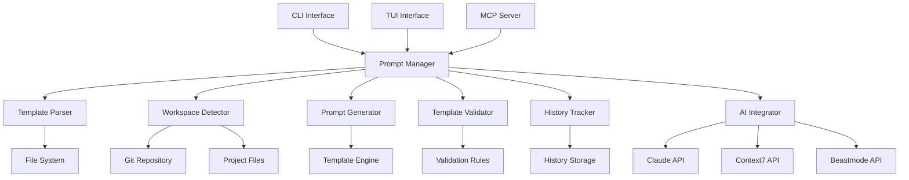
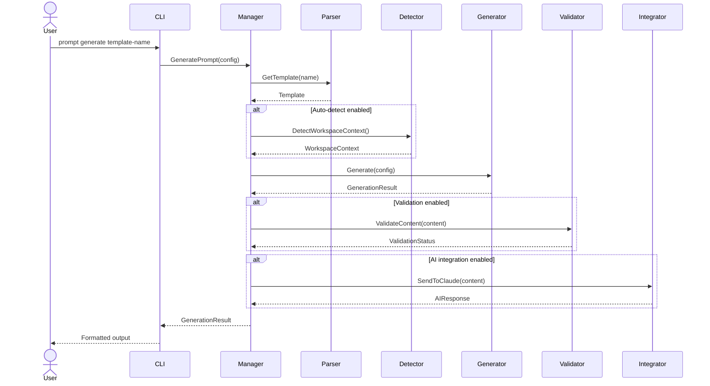
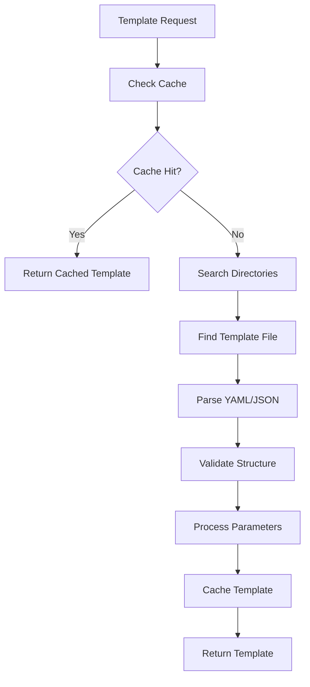
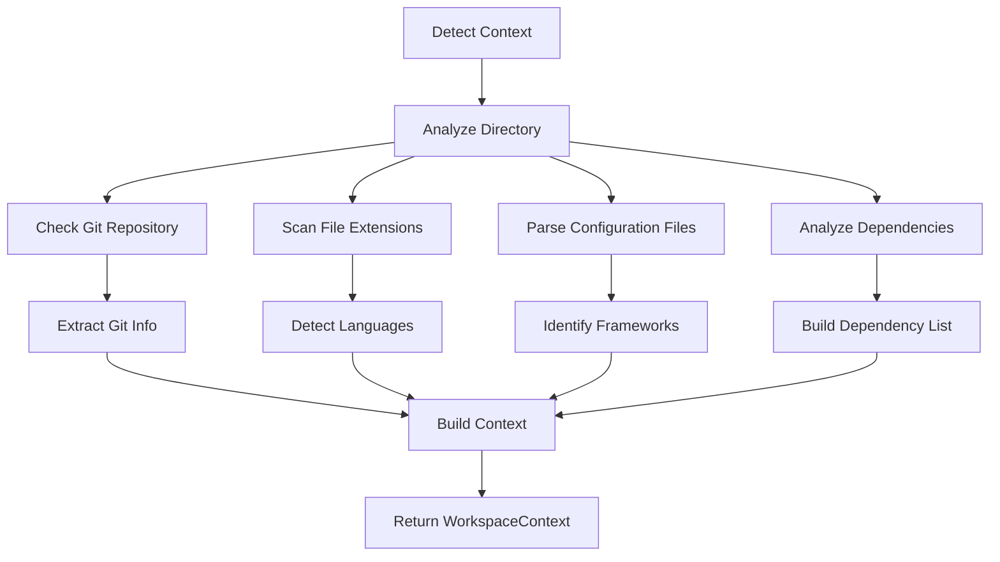

# Prompt System Architecture Overview

This document provides a comprehensive overview of the vibes-mcp-cli prompt system architecture, including system design, components, data flow, and extension patterns.

## Table of Contents

- [System Overview](#system-overview)
- [Core Components](#core-components)
- [Architecture Layers](#architecture-layers)
- [Data Flow](#data-flow)
- [Integration Points](#integration-points)
- [Extension Patterns](#extension-patterns)
- [Performance Considerations](#performance-considerations)

## System Overview

The prompt system is designed as a modular, extensible framework for generating structured AI prompts with support for template management, workspace context detection, and AI tool integration.

### Design Principles

1. **Modularity**: Clear separation of concerns with well-defined interfaces
2. **Extensibility**: Plugin-based architecture for adding new features
3. **Scalability**: Efficient handling of large template collections and high throughput
4. **Reliability**: Robust error handling and graceful degradation
5. **Usability**: Intuitive CLI and TUI interfaces with comprehensive documentation

### High-Level Architecture



## Core Components

### 1. Prompt Manager (`internal/prompt/manager.go`)

The central orchestrator that coordinates all prompt system operations.

**Responsibilities:**
- Template lifecycle management
- Prompt generation coordination
- Configuration management
- Integration orchestration

**Key Interfaces:**
```go
type Manager interface {
    // Template operations
    ListTemplates(category string) ([]Template, error)
    GetTemplate(name string) (Template, error)
    CreateTemplateInteractive(name string) error
    
    // Generation operations
    GeneratePrompt(config *GenerationConfig) (*GenerationResult, error)
    DetectWorkspaceContext() (*WorkspaceContext, error)
    
    // Validation operations
    ValidateTemplate(name string) (bool, []string)
    ValidateAllTemplates() (*ValidationReport, error)
    
    // Integration operations
    CopyToClipboard(content string) error
    UseContext7(result *GenerationResult) error
    TriggerBeastmode(result *GenerationResult) error
}
```

### 2. Template Parser (`internal/prompt/template.go`)

Handles template file loading, parsing, and validation.

**Responsibilities:**
- YAML/JSON template parsing
- Template structure validation
- File system operations
- Template caching

**Key Features:**
- Support for multiple template formats (YAML, JSON, Markdown)
- Template inheritance and composition
- Parameter validation and type checking
- Efficient caching and lazy loading

### 3. Workspace Detector (`internal/prompt/workspace.go`)

Analyzes project context to provide intelligent template suggestions.

**Responsibilities:**
- Programming language detection
- Framework identification
- Git repository analysis
- Dependency analysis
- Recent activity tracking

**Detection Logic:**
```go
type WorkspaceDetector interface {
    DetectContext(ctx context.Context) (*WorkspaceContext, error)
    DetectLanguage(directory string) (string, error)
    DetectFramework(directory, language string) (string, error)
    GetRecentFiles(directory string, limit int) ([]string, error)
    GetGitStatus(directory string) (string, string, error)
    GetDependencies(directory, language string) ([]Dependency, error)
}
```

### 4. Prompt Generator (`internal/prompt/generator.go`)

Processes templates and generates final prompts with parameter substitution.

**Responsibilities:**
- Template parameter processing
- Interactive parameter collection
- Content generation and formatting
- Output format handling

**Generation Pipeline:**
1. Load template
2. Collect parameters (interactive or direct)
3. Validate parameters
4. Process template content
5. Apply formatting
6. Calculate statistics

### 5. Template Validator (`internal/prompt/validator.go`)

Ensures template quality and consistency through comprehensive validation.

**Responsibilities:**
- Template structure validation
- Content quality assessment
- Parameter consistency checking
- Example validation

**Validation Criteria:**
- **Structure**: Required fields, valid YAML/JSON syntax
- **Content**: Clarity, completeness, actionability
- **Parameters**: Type consistency, required field validation
- **Examples**: Syntax correctness, parameter coverage

### 6. History Tracker (`internal/prompt/history.go`)

Manages prompt generation history and usage analytics.

**Responsibilities:**
- Generation history recording
- Usage statistics tracking
- History querying and filtering
- Data persistence

**Data Model:**
```go
type HistoryEntry struct {
    ID           string            `json:"id"`
    Template     string            `json:"template"`
    Repository   string            `json:"repository"`
    Language     string            `json:"language"`
    Parameters   map[string]string `json:"parameters"`
    OutputMethod string            `json:"output_method"`
    AITool       string            `json:"ai_tool,omitempty"`
    Success      bool              `json:"success"`
    Timestamp    time.Time         `json:"timestamp"`
    Duration     time.Duration     `json:"duration"`
    WordCount    int               `json:"word_count"`
}
```

### 7. AI Integrator (`internal/prompt/integration.go`)

Manages integrations with external AI tools and services.

**Responsibilities:**
- API communication with AI services
- Authentication and authorization
- Response processing and formatting
- Error handling and retries

**Supported Integrations:**
- **Claude**: Direct API integration with Anthropic
- **Context7**: Documentation enrichment service
- **Beastmode**: Autonomous development workflows
- **Webhooks**: Custom notification endpoints
- **Slack**: Team collaboration notifications

## Architecture Layers

### Presentation Layer

**Components:**
- CLI Interface (`cmd/prompt.go`)
- TUI Interface (`internal/ui/components/prompt_*.go`)
- MCP Server (`internal/mcp/prompt_*.go`)

**Responsibilities:**
- User input handling
- Command parsing and validation
- Output formatting and display
- Error presentation

### Business Logic Layer

**Components:**
- Prompt Manager (`internal/prompt/manager.go`)
- Template Processing (`internal/prompt/template.go`)
- Workspace Analysis (`internal/prompt/workspace.go`)

**Responsibilities:**
- Core business logic implementation
- Template management and processing
- Workspace context analysis
- Integration coordination

### Service Layer

**Components:**
- Template Parser
- Prompt Generator
- Template Validator
- History Tracker
- AI Integrator

**Responsibilities:**
- Specialized service implementations
- External API communication
- Data processing and transformation
- Service coordination

### Data Layer

**Components:**
- File System Operations
- Configuration Management
- History Storage
- Template Storage

**Responsibilities:**
- Data persistence and retrieval
- File system operations
- Configuration management
- Caching and optimization

## Data Flow

### Template Processing Flow



### Template Loading Flow



### Workspace Detection Flow



## Integration Points

### 1. MCP (Model Context Protocol) Integration

**Location:** `internal/mcp/prompt_*.go`

**Features:**
- RESTful API endpoints for prompt operations
- WebSocket support for real-time updates
- JSON-RPC protocol compliance
- Authentication and authorization

**Endpoints:**
```
GET    /v1/prompts/templates          - List templates
GET    /v1/prompts/templates/:name    - Get template details
POST   /v1/prompts/generate           - Generate prompt
POST   /v1/prompts/validate          - Validate template
GET    /v1/prompts/history           - Get generation history
GET    /v1/prompts/context           - Get workspace context
```

### 2. CLI Integration

**Location:** `cmd/prompt.go`

**Features:**
- Comprehensive command structure
- Interactive and batch modes
- Parameter validation and completion
- Rich output formatting

**Commands:**
```bash
vibes-mcp-cli prompt list [category]
vibes-mcp-cli prompt show <template>
vibes-mcp-cli prompt generate <template> [flags]
vibes-mcp-cli prompt validate [template]
vibes-mcp-cli prompt create <template>
vibes-mcp-cli prompt config [action] [key] [value]
```

### 3. TUI Integration

**Location:** `internal/ui/components/prompt_*.go`

**Features:**
- Interactive template browsing
- Visual template editor
- Real-time validation feedback
- History navigation

**Components:**
- Template Browser
- Prompt Generator Modal
- Template Editor
- History Viewer
- Configuration Panel

### 4. AI Service Integration

**Location:** `internal/prompt/integration.go`

**Features:**
- Multi-provider support
- Async processing
- Rate limiting and retries
- Response caching

**Integration Pattern:**
```go
type AIProvider interface {
    ProcessPrompt(ctx context.Context, prompt string) (*AIResponse, error)
    ValidateCredentials() error
    GetCapabilities() []string
}
```

## Extension Patterns

### 1. Template Engine Extensions

**Custom Template Processors:**
```go
type TemplateProcessor interface {
    Name() string
    SupportedFormats() []string
    Process(content string, params map[string]string) (string, error)
}

// Register custom processor
RegisterTemplateProcessor(&CustomMarkdownProcessor{})
```

**Template Hooks:**
```go
type TemplateHook interface {
    BeforeGenerate(template *Template, params map[string]string) error
    AfterGenerate(result *GenerationResult) error
}
```

### 2. Workspace Detector Extensions

**Custom Language Detectors:**
```go
type LanguageDetector interface {
    Name() string
    DetectLanguage(files []string) (string, float64)
    DetectFramework(language string, files []string) (string, float64)
}

// Register custom detector
RegisterLanguageDetector(&CustomRustDetector{})
```

### 3. AI Integration Extensions

**Custom AI Providers:**
```go
type AIProvider interface {
    Name() string
    ProcessPrompt(ctx context.Context, request *AIRequest) (*AIResponse, error)
    ValidateConfig(config map[string]interface{}) error
}

// Register custom provider
RegisterAIProvider(&CustomOpenAIProvider{})
```

### 4. Output Format Extensions

**Custom Formatters:**
```go
type OutputFormatter interface {
    Name() string
    Format(content string, metadata map[string]interface{}) (string, error)
    MimeType() string
}

// Register custom formatter
RegisterOutputFormatter(&CustomHTMLFormatter{})
```

### 5. Plugin System

**Plugin Interface:**
```go
type Plugin interface {
    Name() string
    Version() string
    Initialize(config map[string]interface{}) error
    Execute(ctx context.Context, event *PluginEvent) error
    Cleanup() error
}
```

**Plugin Events:**
- `template_loaded`
- `prompt_generated`
- `validation_completed`
- `ai_response_received`

## Performance Considerations

### 1. Caching Strategy

**Template Caching:**
- In-memory cache for frequently used templates
- File modification time-based invalidation
- Configurable cache size and TTL

**Workspace Context Caching:**
- Cache workspace analysis results
- Invalidate on file system changes
- Background refresh for active projects

### 2. Concurrency Model

**Template Processing:**
- Concurrent template loading
- Parallel parameter validation
- Async AI integration calls

**Resource Management:**
- Connection pooling for AI APIs
- Rate limiting to prevent API abuse
- Circuit breakers for external services

### 3. Memory Management

**Efficient Data Structures:**
- Lazy loading of template content
- String interning for common values
- Memory pools for frequent allocations

**Resource Cleanup:**
- Automatic cache eviction
- Connection cleanup on shutdown
- Graceful degradation under memory pressure

### 4. I/O Optimization

**File Operations:**
- Batch file system operations
- Efficient directory traversal
- Async file I/O where possible

**Network Operations:**
- HTTP/2 connection reuse
- Request batching for APIs
- Compressed response handling

### 5. Scalability Patterns

**Horizontal Scaling:**
- Stateless service design
- External session storage
- Load balancer compatibility

**Vertical Scaling:**
- Efficient CPU utilization
- Memory usage optimization
- I/O bottleneck elimination

### 6. Monitoring and Metrics

**Performance Metrics:**
```go
type Metrics struct {
    TemplateLoadTime      time.Duration
    PromptGenerationTime  time.Duration
    AIIntegrationTime     time.Duration
    CacheHitRate          float64
    ErrorRate             float64
    RequestsPerSecond     float64
}
```

**Health Checks:**
- Template availability
- AI service connectivity
- File system accessibility
- Memory usage monitoring

### 7. Configuration Tuning

**Performance Settings:**
```yaml
performance:
  cache:
    template_cache_size: 1000
    template_cache_ttl: "1h"
    context_cache_ttl: "5m"
    
  concurrency:
    max_concurrent_generations: 10
    ai_request_timeout: "30s"
    workspace_detection_timeout: "10s"
    
  resources:
    max_memory_usage: "500MB"
    max_disk_cache: "1GB"
    connection_pool_size: 20
```

## Security Architecture

### 1. Authentication and Authorization

**API Key Management:**
- Secure storage of API credentials
- Key rotation support
- Scope-based access control

**User Authentication:**
- Integration with existing auth systems
- Session management
- Role-based permissions

### 2. Data Security

**Sensitive Data Handling:**
- Encryption at rest and in transit
- Secure parameter handling
- PII detection and masking

**Audit Logging:**
- Comprehensive audit trails
- Tamper-evident logging
- Compliance reporting

### 3. Network Security

**API Security:**
- TLS/SSL encryption
- Rate limiting and throttling
- Input validation and sanitization

**Integration Security:**
- Webhook signature verification
- Certificate pinning
- Secure communication protocols

This architecture provides a solid foundation for the prompt system while maintaining flexibility for future enhancements and integrations. For implementation details, see the [API Reference](Prompt-API.md) and [Development Guide](Prompt-Development.md).