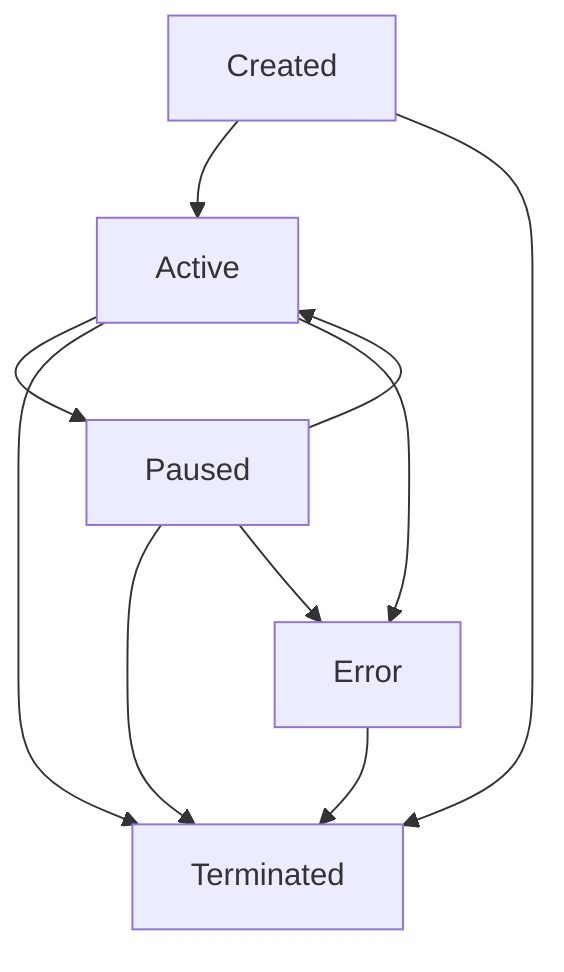

# Session Management Guide

This guide provides comprehensive documentation for the session management system in vibes-mcp-cli, covering session lifecycle, operations, monitoring, and best practices for managing multiple Claude Code sessions.

## Table of Contents

- [Overview](#overview)
- [Session Lifecycle](#session-lifecycle)
- [Session Operations](#session-operations)
- [Configuration](#configuration)
- [Monitoring and Statistics](#monitoring-and-statistics)
- [Error Handling](#error-handling)
- [Best Practices](#best-practices)
- [Troubleshooting](#troubleshooting)
- [Advanced Usage](#advanced-usage)

## Overview

The session management system enables you to create, manage, and monitor multiple concurrent Claude Code sessions. Each session represents an isolated environment where you can interact with Claude Code, send files, execute commands, and capture output.

### Key Features

- **Multi-Session Support**: Run multiple Claude Code sessions simultaneously
- **Session Persistence**: Sessions survive application restarts
- **Real-Time I/O**: Stream input and output in real-time
- **Resource Monitoring**: Track CPU, memory, and I/O usage
- **Automatic Cleanup**: Configurable cleanup of terminated sessions
- **State Management**: Comprehensive session state tracking
- **Security Isolation**: Each session runs in its own secure environment

### Architecture

```
Session Manager
├── Session Registry (Persistence)
├── Claude Executor (Process Management)
├── Resource Monitor (Usage Tracking)
└── Individual Sessions
    ├── Process Management
    ├── I/O Streaming
    ├── State Tracking
    └── Statistics Collection
```

## Session Lifecycle

### Session States

Sessions progress through defined states during their lifecycle:

```go
type SessionState int

const (
    SessionStateCreated    // Just created, not yet started
    SessionStateActive     // Running and accepting input
    SessionStatePaused     // Paused but can be resumed
    SessionStateTerminated // Terminated and cannot be restarted
    SessionStateError      // Error state requiring intervention
)
```

### State Transitions



**Valid Transitions:**
- `Created` → `Active`: Start session
- `Active` → `Paused`: Pause session
- `Paused` → `Active`: Resume session
- `Active`/`Paused`/`Created` → `Terminated`: Terminate session
- Any state → `Error`: Error occurred

## Session Operations

### Creating Sessions

#### Basic Session Creation

```go
// Create manager
config := session.DefaultManagerConfig()
manager, err := session.NewManager(config, logger)
if err != nil {
    log.Fatal(err)
}
defer manager.Close()

// Create session
sessionConfig := session.DefaultSessionConfig()
sessionConfig.Name = "my-claude-session"
sessionConfig.WorkingDir = "/home/user/projects"

sess, err := manager.CreateSession("main", sessionConfig)
if err != nil {
    log.Fatal(err)
}
```

#### Advanced Session Configuration

```go
sessionConfig := &session.SessionConfig{
    Name:        "development-session",
    WorkingDir:  "/home/user/projects/myapp",
    Environment: map[string]string{
        "PATH":     "/usr/local/bin:/usr/bin:/bin",
        "LANG":     "en_US.UTF-8",
        "PROJECT":  "myapp",
    },
    Args: []string{
        "--project", "/home/user/projects/myapp",
        "--verbose",
    },
    AutoSave:   true,
    MaxHistory: 2000,
}

sess, err := manager.CreateSession("dev", sessionConfig)
```

### Session Control Operations

#### Starting Sessions

```go
// Start a session
if err := manager.StartSession(sess.GetID()); err != nil {
    log.Printf("Failed to start session: %v", err)
}

// Check if session is active
if sess.IsActive() {
    log.Println("Session is now active")
}
```

#### Pausing and Resuming

```go
// Pause an active session
if err := manager.PauseSession(sess.GetID()); err != nil {
    log.Printf("Failed to pause session: %v", err)
}

// Resume a paused session
if err := manager.ResumeSession(sess.GetID()); err != nil {
    log.Printf("Failed to resume session: %v", err)
}
```

#### Terminating Sessions

```go
// Graceful termination
if err := manager.TerminateSession(sess.GetID()); err != nil {
    log.Printf("Failed to terminate session: %v", err)
}

// Force deletion (terminates if active)
if err := manager.DeleteSession(sess.GetID(), true); err != nil {
    log.Printf("Failed to delete session: %v", err)
}
```

### I/O Operations

#### Sending Input

```go
// Send command to session
input := "help\n"
if err := manager.SendInput(sess.GetID(), input); err != nil {
    log.Printf("Failed to send input: %v", err)
}

// Send file content
content, err := ioutil.ReadFile("/path/to/file.py")
if err != nil {
    log.Fatal(err)
}

fileInput := fmt.Sprintf("Here's the content of file.py:\n\n%s\n", content)
if err := manager.SendInput(sess.GetID(), fileInput); err != nil {
    log.Printf("Failed to send file content: %v", err)
}
```

#### Retrieving Output

```go
// Get accumulated output
output, err := manager.GetOutput(sess.GetID())
if err != nil {
    log.Printf("Failed to get output: %v", err)
} else {
    fmt.Println("Session output:")
    fmt.Println(string(output))
}
```

#### Real-Time Output Streaming

```go
// Subscribe to real-time output
outputChan, err := manager.SubscribeToOutput(sess.GetID())
if err != nil {
    log.Fatal(err)
}

// Process output in real-time
go func() {
    for output := range outputChan {
        fmt.Print(string(output))
    }
}()
```

### Session Discovery

#### Listing Sessions

```go
// List all sessions
sessions := manager.ListSessions()
for _, sess := range sessions {
    fmt.Printf("Session: %s (%s) - State: %s\n", 
        sess.GetName(), sess.GetID(), sess.GetState().String())
}

// List only active sessions
activeSessions := manager.ListActiveSessions()
fmt.Printf("Active sessions: %d\n", len(activeSessions))
```

#### Finding Sessions

```go
// Get session by ID
sess, err := manager.GetSession("session-123456789")
if err != nil {
    log.Printf("Session not found: %v", err)
}

// Get session by name
sess, err := manager.GetSessionByName("development-session")
if err != nil {
    log.Printf("Session not found: %v", err)
}
```

## Configuration

### Manager Configuration

Configure the session manager behavior:

```go
config := &session.ManagerConfig{
    StoragePath:     "/var/lib/vibes/sessions", // Session storage directory
    MaxSessions:     20,                        // Maximum concurrent sessions
    DefaultTimeout:  time.Hour * 4,             // Default session timeout
    CleanupInterval: time.Hour * 2,             // Cleanup interval
    AutoCleanup:     true,                      // Enable automatic cleanup
    ClaudePath:      "/usr/local/bin/claude",   // Path to Claude executable
}

manager, err := session.NewManager(config, logger)
```

### Session Configuration

Configure individual session behavior:

```go
sessionConfig := &session.SessionConfig{
    Name:        "custom-session",
    WorkingDir:  "/workspace",
    Environment: map[string]string{
        "PYTHONPATH": "/workspace/lib",
        "DEBUG":      "true",
    },
    Args: []string{
        "--config", "/workspace/.claude-config",
        "--log-level", "debug",
    },
    AutoSave:   true,   // Automatically save session state
    MaxHistory: 5000,   // Maximum history entries to keep
}
```

### Environment Variables

Configure session management via environment variables:

```bash
export VIBES_SESSION_STORAGE="/var/lib/vibes/sessions"
export VIBES_MAX_SESSIONS="15"
export VIBES_CLAUDE_PATH="/opt/claude/bin/claude"
export VIBES_AUTO_CLEANUP="true"
export VIBES_CLEANUP_INTERVAL="3600" # seconds
```

## Monitoring and Statistics

### Session Statistics

Get detailed statistics for individual sessions:

```go
metadata := sess.GetMetadata()
stats := metadata.Stats

fmt.Printf("Session Statistics:\n")
fmt.Printf("  Input Count: %d\n", stats.InputCount)
fmt.Printf("  Output Bytes: %d\n", stats.OutputBytes)
fmt.Printf("  Duration: %v\n", stats.Duration)
fmt.Printf("  Last Active: %s\n", stats.LastActive.Format(time.RFC3339))
fmt.Printf("  Process Count: %d\n", stats.ProcessCount)
fmt.Printf("  Error Count: %d\n", stats.ErrorCount)
```

### Manager Statistics

Get overall manager statistics:

```go
stats := manager.GetStats()
fmt.Printf("Manager Statistics:\n")
fmt.Printf("  Total Sessions: %d\n", stats.TotalSessions)
fmt.Printf("  Active Sessions: %d\n", stats.ActiveSessions)
fmt.Printf("  Paused Sessions: %d\n", stats.PausedSessions)
fmt.Printf("  Terminated Sessions: %d\n", stats.TerminatedSessions)
fmt.Printf("  Error Sessions: %d\n", stats.ErrorSessions)
```

### Resource Monitoring

Monitor resource usage for sessions:

```go
// Get resource usage for a session
// (This would be implemented based on the executor's resource monitor)
if sess.IsActive() {
    // Resource monitoring would be accessed through the executor
    fmt.Printf("Session %s is consuming resources\n", sess.GetName())
}
```

## Error Handling

### Common Error Scenarios

#### Session Creation Errors

```go
sess, err := manager.CreateSession("test", config)
if err != nil {
    switch {
    case strings.Contains(err.Error(), "maximum number of sessions"):
        log.Println("Too many sessions - clean up terminated sessions")
        // Clean up terminated sessions
        for _, s := range manager.ListSessions() {
            if s.IsTerminated() {
                manager.DeleteSession(s.GetID(), true)
            }
        }
    case strings.Contains(err.Error(), "failed to register session"):
        log.Println("Session registry error - check storage permissions")
    default:
        log.Printf("Unexpected session creation error: %v", err)
    }
}
```

#### I/O Operation Errors

```go
if err := manager.SendInput(sessionID, input); err != nil {
    switch {
    case strings.Contains(err.Error(), "session in state"):
        log.Printf("Session not in correct state for input: %v", err)
        // Check session state and handle accordingly
        state := sess.GetState()
        if state == session.SessionStatePaused {
            manager.ResumeSession(sessionID)
        }
    case strings.Contains(err.Error(), "process not running"):
        log.Println("Claude Code process not running - restart session")
    default:
        log.Printf("Input error: %v", err)
    }
}
```

### Error Recovery Patterns

#### Automatic Recovery

```go
func sendInputWithRetry(manager *session.Manager, sessionID, input string, maxRetries int) error {
    for i := 0; i < maxRetries; i++ {
        err := manager.SendInput(sessionID, input)
        if err == nil {
            return nil
        }
        
        // Check if session needs to be resumed
        sess, getErr := manager.GetSession(sessionID)
        if getErr != nil {
            return getErr
        }
        
        if sess.IsPaused() {
            if resumeErr := manager.ResumeSession(sessionID); resumeErr != nil {
                return resumeErr
            }
            continue // Retry after resuming
        }
        
        time.Sleep(time.Second * time.Duration(i+1)) // Exponential backoff
    }
    return fmt.Errorf("failed to send input after %d retries", maxRetries)
}
```

## Best Practices

### Session Management

1. **Use Descriptive Names**: Give sessions meaningful names
```go
sessionConfig.Name = "frontend-development"  // Good
sessionConfig.Name = "session1"             // Avoid
```

2. **Set Appropriate Working Directories**: Use project-specific directories
```go
sessionConfig.WorkingDir = "/workspace/myproject"
```

3. **Configure Environment Variables**: Set up project-specific environment
```go
sessionConfig.Environment = map[string]string{
    "PROJECT_ROOT": "/workspace/myproject",
    "NODE_ENV":     "development",
}
```

4. **Enable Auto-Save**: Ensure session state is preserved
```go
sessionConfig.AutoSave = true
```

### Resource Management

1. **Monitor Session Count**: Don't exceed reasonable limits
```go
if manager.GetSessionCount() > 10 {
    log.Println("Warning: High number of sessions")
}
```

2. **Clean Up Terminated Sessions**: Regularly clean up old sessions
```go
// Cleanup routine
go func() {
    ticker := time.NewTicker(time.Hour)
    defer ticker.Stop()
    
    for range ticker.C {
        for _, sess := range manager.ListSessions() {
            if sess.IsTerminated() {
                metadata := sess.GetMetadata()
                if time.Since(metadata.UpdatedAt) > 24*time.Hour {
                    manager.DeleteSession(sess.GetID(), true)
                }
            }
        }
    }
}()
```

3. **Use Resource Limits**: Configure appropriate resource limits
```go
config.MaxSessions = 15 // Reasonable limit based on system resources
```

### Error Handling

1. **Always Check Errors**: Handle all error returns properly
```go
if err := manager.StartSession(sessionID); err != nil {
    log.Printf("Failed to start session: %v", err)
    return err
}
```

2. **Implement Graceful Degradation**: Handle errors without crashing
```go
if err := manager.SendInput(sessionID, input); err != nil {
    log.Printf("Input failed, queuing for retry: %v", err)
    // Queue input for retry
}
```

3. **Log Important Events**: Maintain audit trail
```go
logger.Info("session started",
    zap.String("session_id", sessionID),
    zap.String("name", sessionConfig.Name))
```

## Troubleshooting

### Common Issues

#### Session Won't Start

**Symptoms**: Session creation succeeds but starting fails

**Possible Causes**:
- Claude Code executable not found
- Insufficient permissions
- Resource limits exceeded

**Solutions**:
```go
// Check if Claude executable exists
if _, err := os.Stat(config.ClaudePath); os.IsNotExist(err) {
    log.Fatal("Claude executable not found:", config.ClaudePath)
}

// Check resource usage
stats := manager.GetStats()
if stats.ActiveSessions >= config.MaxSessions {
    log.Println("Maximum sessions reached, cleaning up terminated sessions")
}
```

#### Session Becomes Unresponsive

**Symptoms**: Session shows as active but doesn't respond to input

**Possible Causes**:
- Claude Code process crashed
- Resource exhaustion
- I/O pipe broken

**Solutions**:
```go
// Check session state and restart if needed
if sess.IsActive() {
    // Try sending a simple command with timeout
    done := make(chan bool, 1)
    go func() {
        manager.SendInput(sessionID, "\n")
        done <- true
    }()
    
    select {
    case <-done:
        // Session responded
    case <-time.After(5 * time.Second):
        // Session unresponsive, restart
        log.Println("Session unresponsive, restarting")
        manager.TerminateSession(sessionID)
        manager.StartSession(sessionID)
    }
}
```

#### Memory Leaks

**Symptoms**: Memory usage continuously increases

**Possible Causes**:
- Not closing output channels
- Accumulating session history
- Not cleaning up terminated sessions

**Solutions**:
```go
// Properly close output channels
outputChan, err := manager.SubscribeToOutput(sessionID)
if err != nil {
    return err
}
defer func() {
    // Close channel when done
    for range outputChan {
        // Drain remaining messages
    }
}()

// Limit session history
sessionConfig.MaxHistory = 1000

// Regular cleanup
if err := manager.SaveAllSessions(); err != nil {
    log.Printf("Failed to save sessions: %v", err)
}
```

### Debugging

#### Enable Debug Logging

```go
logger, _ := zap.NewDevelopment()
manager, err := session.NewManager(config, logger)
```

#### Session State Inspection

```go
func debugSession(sess *session.Session) {
    metadata := sess.GetMetadata()
    
    fmt.Printf("Session Debug Info:\n")
    fmt.Printf("  ID: %s\n", metadata.ID)
    fmt.Printf("  Name: %s\n", metadata.Name)
    fmt.Printf("  State: %s\n", metadata.State.String())
    fmt.Printf("  Created: %s\n", metadata.CreatedAt.Format(time.RFC3339))
    fmt.Printf("  Updated: %s\n", metadata.UpdatedAt.Format(time.RFC3339))
    
    if metadata.Stats != nil {
        fmt.Printf("  Stats:\n")
        fmt.Printf("    Inputs: %d\n", metadata.Stats.InputCount)
        fmt.Printf("    Output bytes: %d\n", metadata.Stats.OutputBytes)
        fmt.Printf("    Errors: %d\n", metadata.Stats.ErrorCount)
    }
}
```

## Advanced Usage

### Custom Session Types

Create specialized session configurations for different use cases:

```go
func NewDevelopmentSession(projectPath string) *session.SessionConfig {
    return &session.SessionConfig{
        Name:       "development",
        WorkingDir: projectPath,
        Environment: map[string]string{
            "NODE_ENV":     "development",
            "DEBUG":        "true",
            "PROJECT_ROOT": projectPath,
        },
        Args: []string{
            "--dev-mode",
            "--project", projectPath,
        },
        AutoSave:   true,
        MaxHistory: 2000,
    }
}

func NewProductionSession(projectPath string) *session.SessionConfig {
    return &session.SessionConfig{
        Name:       "production",
        WorkingDir: projectPath,
        Environment: map[string]string{
            "NODE_ENV":     "production",
            "PROJECT_ROOT": projectPath,
        },
        Args: []string{
            "--production",
            "--project", projectPath,
        },
        AutoSave:   true,
        MaxHistory: 5000,
    }
}
```

### Session Pools

Manage pools of sessions for different purposes:

```go
type SessionPool struct {
    manager     *session.Manager
    sessions    map[string]*session.Session
    sessionType string
}

func NewSessionPool(manager *session.Manager, sessionType string) *SessionPool {
    return &SessionPool{
        manager:     manager,
        sessions:    make(map[string]*session.Session),
        sessionType: sessionType,
    }
}

func (sp *SessionPool) GetOrCreateSession(name string) (*session.Session, error) {
    if sess, exists := sp.sessions[name]; exists && sess.IsActive() {
        return sess, nil
    }
    
    config := sp.getConfigForType(sp.sessionType)
    config.Name = name
    
    sess, err := sp.manager.CreateSession(name, config)
    if err != nil {
        return nil, err
    }
    
    if err := sp.manager.StartSession(sess.GetID()); err != nil {
        return nil, err
    }
    
    sp.sessions[name] = sess
    return sess, nil
}
```

### Batch Operations

Perform operations on multiple sessions:

```go
func (m *Manager) TerminateAllSessions() error {
    sessions := m.ListActiveSessions()
    var errors []error
    
    for _, sess := range sessions {
        if err := m.TerminateSession(sess.GetID()); err != nil {
            errors = append(errors, err)
        }
    }
    
    if len(errors) > 0 {
        return fmt.Errorf("failed to terminate %d sessions", len(errors))
    }
    
    return nil
}

func (m *Manager) BroadcastInput(input string) error {
    sessions := m.ListActiveSessions()
    var errors []error
    
    for _, sess := range sessions {
        if err := m.SendInput(sess.GetID(), input); err != nil {
            errors = append(errors, err)
        }
    }
    
    if len(errors) > 0 {
        return fmt.Errorf("failed to send input to %d sessions", len(errors))
    }
    
    return nil
}
```

---

This comprehensive session management guide covers all aspects of working with Claude Code sessions in the vibes-mcp-cli. For API details, see the [API Reference](API-Reference.md), and for UI integration, see the [TUI Usage](TUI-Usage.md) guide.